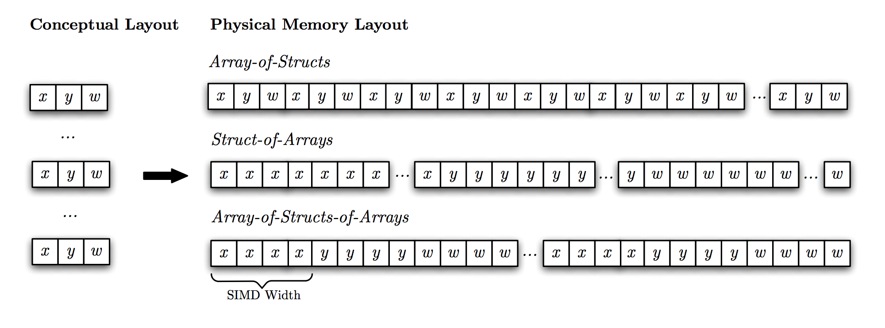

.. role:: cpp(code)
   :language: c++

Array-of-Structs-of-Arrays (AoSoA)
==================================

Particles in Cabana are not represented individually by a singular data
structure. Rather, they are always represented in groups within a data
structure known as an Array-of-Structs-of-Arrays (AoSoA). An AoSoA is a
generalization of the more commonly known Struct-of-Arrays (SoA) and
Array-of-Structs (AoS) with both being common choices in practice depending on
the type of computation and the architecture on which the simulation is
performed.

First consider the AoS data layout. In this case we can define a ``Particle``
data structure (the struct) to hold our particle information. We will define a
particle with three data members: a single precision position, a double
precision velocity, and an integer material id:

.. highlight:: c++

::

   struct Particle
   {
       float pos_x;
       float pos_y;
       float pos_z;
       double vel_x;
       double vel_y;
       double vel_z;
       int matid;
   };

An AoS is then very simply an array of these structs
(e.g. ``std::vector<Particle>``). From a programming point of view this is
very convenient as the data for a single particle is encapsulated in one data
structure. For example, basic operations such as sorting can be performed with
many standard library routines and communicating particles between MPI ranks
is simple as the contiguous nature of particle data allows for easy
serialization.

An SoA is an inversion of the AoS principle. We can very easily re-write our
``Particle`` struct from before to now be a Struct-of-Arrays:

.. highlight:: c++

::

   struct ParticleArray
   {
       std::vector<float> pos_x;
       std::vector<float> pos_y;
       std::vector<float> pos_z;
       std::vector<double> vel_x;
       std::vector<double> vel_y;
       std::vector<double> vel_z;
       std::vector<int> matid;
   };

Here each data member is now a dynamic array holding the data for each
particle instead of an individual particle. In the context of performance, one
can see how looping over this data structure and performing operations on
particles will produce a very different memory access pattern than loops over
an AoS (e.g. ``std::vector<Particle>``).

An AoSoA is a generalization of both of these principles. First consider an
SoA of fixed size, ``ARRAY_SIZE``, where ``ARRAY_SIZE`` is typically much
smaller than the total number of particles:

.. highlight:: c++

::

   struct SoA
   {
       float pos_x[ARRAY_SIZE];
       float pos_y[ARRAY_SIZE];
       float pos_z[ARRAY_SIZE];
       double vel_x[ARRAY_SIZE];
       double vel_y[ARRAY_SIZE];
       double vel_z[ARRAY_SIZE];
       int matid[ARRAY_SIZE];
   };

An AoSoA is then simply a dynamic array of these fixed-size SoA data
structures (e.g. ``std::vector<SoA>``). Conveniently, this type of data
structure encapsulates both AoS and SoA memory access patterns by simply
altering the ``ARRAY_SIZE``:

* If ``ARRAY_SIZE`` is 1, the AoSoA is identical to an AoS.
* If ``ARRAY_SIZE`` is equal to the number of particles, it is identical to an
  SoA.

When ``ARRAY_SIZE`` is somewhere in between 1 and the number of particles,
different types of memory access patterns can be exposed allowing for better
performance both on different architectures and in different types of
computational kernels. In addition, the 2-dimensional nature of this data
structure exposes opportunities for additional types of parallelism on
architectures that support 2-dimensional thread indexing concepts.

To further elucidate the difference between the data structures consider the
following figure:

   **A comparison of data layouts in Array-of-Structs (AoS), Struct-of-Arrays
   (SoA), and Array-of-Structs-of-Arrays (AoSoA).** *In AoS, particle data
   (x,y,w) is represented in a contiguous block for every particle. In SoA,
   there is a contiguous array of x, an array of y, and an array of w, each of
   the size of the number of particles. In AoSoA, each component is stored in
   smaller contiguous chunks (perhaps the size of a vectorization unit).*

From a performance and usability point of view, there is a potential benefit
to all three layouts. In the case of AoS, this allows for a very clean set of
abstractions on a particle-by-particle basis as including ease of
programmability. In the case of SoA, the large contiguous chunks of memory for
each variable may have potential benefit both in terms of contiguous memory
accesses as well as efficient vectorization. AoSoA also supports vectorization
through smaller contiguous blocks of member data variables as well as
potential improvements to cache efficiency due to the smaller sizes of those
blocks.

Within Cabana, the AoSoA is represented by the ``Cabana::AoSoA`` class. Next
we will overview this class and its API.

Defining Particle Data Types
----------------------------

Users may assign any data to their particles within Cabana as long as that
data is composed of trivial types and classes. A trivial type is a type whose:

* storage is contiguous (trivially copyable),
* which only supports static default initialization (trivially default
  constructible), either cv-qualified or not.

Trivial types include scalar types, trivial classes and arrays of any such
types. A trivial class is a class (defined with class, struct or union) that
is both trivially default constructible and trivially copyable, which implies
that:

* uses the implicitly defined default copy and move constructors, copy
  and move assignments, and destructor,
* has no virtual members,
* has no non-static data members with brace- or equal- initializers,
* its base class and non-static data members (if any) are themselves also
  trivial types.

Cabana provides a type to users, ``Cabana::MemberDataTypes``, which is then
used to define the data associated with a particle. For example, using our
particle example from above we would define the following types of particle
data:

.. highlight:: c++

::

   using DataTypes = Cabana::MemberDataTypes<double, // vel_x
                                             double, // vel_y
                                             double, // vel_z
                                             float,  // pos_x
                                             float,  // pos_y
                                             float,  // pos_z
                                             int>;   // matid

There are a few things to note in this definition. First,
``Cabana::MemberDataTypes`` is itself simply just a list of types and the
comments associated with each entry in the list indicates which type relates
to which particle variable. Second, the types of a larger size
(e.g. ``sizeof(double) > sizeof(float)``) are listed first. We recommend
listing larger data types first and like types sequentially to ensure a
minimal amount of storage of particle data. Storage sizes of particle data
(even for the SoA and AoS examples above) can vary depending on the order of
the data members due to padding to satisfy alignment requirements.

One benefit of allowing for general trivial data types to be associated with
particles is that we can also define **multidimensional** data on
particles. For example, we can re-write our particle data types above to use
multidimensional data instead of representing each data component
individually:

.. highlight:: c++

::

   using DataTypes = Cabana::MemberDataTypes<double[3], // velocity
                                             float[3],  // position
                                             int>;      // matid

This provides two distinct advantages over the scalar data approach. First, it
reduces the overall amount of code as multiple components of the same variable
are now concatenated. This also reduces the amount of code needed to implement
work units as operations on individual components can be replaced with loops
over components. Second, this can offer potential performance advantages as
all components for a single variable can be accessed in a single memory
transaction.

Inner Array Size
----------------

The size of the static arrays within each struct of a ``Cabana::AoSoA`` are
defined via the type ``Cabana::InnerArraySize``. This inner array size is
simply a compile-time integral constant which defines the static size of each
SoA within the AoSoA. Users may define their own inner array size. For
example, to define 128 particles per SoA one would use:

.. highlight:: c++

::

   using ArraySize = Cabana::InnerArraySize<128>;

If the user does not specify the inner array size, the library will
auto-select a (hopefully) reasonably performing inner array size based on the
execution space in which parallel computations will be performed.

Creating an AoSoA
-----------------

There are several template parameters associated with the ``Cabana::AoSoA``
class, however, the most basic definition of the structure only requires the
member data types of the particles and a memory space in which to allocate the
particles. For example, allocating ``1e7`` particles using CUDA UVM with a
double precision velocity, a single precision position, and an integer
material id would be achieved by:

.. highlight:: c++

::

   using DataTypes = Cabana::MemberDataTypes<double[3], // velocity
                                             float[3],  // position
                                             int>;      // matid

   int num_particle = 1e7;
   Cabana::AoSoA<DataTypes,Cabana::CudaUVMSpace> aosoa( num_particle );

In this case, the inner array size will be auto-selected based on the CUDA
execution space associated with the CUDA UVM memory space. If a user wanted
the AoSoA using the same particle types to be compatible with OpenMP
execution and to use an inner array size of 128 they would write:

.. highlight:: c++

::

   using DataTypes = Cabana::MemberDataTypes<double[3], // velocity
                                             float[3],  // position
                                             int>;      // matid

   using ArraySize = Cabana::InnerArraySize<128>;

   int num_particle = 1e7;
   Cabana::AoSoA<DataTypes,ArraySize,Cabana::OpenMP> aosoa( num_particle );

In this case, the particles will be allocated in a memory space
(e.g. HostSpace) compatible with OpenMP execution. Users may assign any
arbitrary number of particles to the AoSoA independent of the choice of inner
array size. Note, however, that although the size may be the requested number
of particles, the amount of memory allocated by the AoSoA will always be in
multiples of the inner array size and therefore more memory may actually
be allocated. The number of structs allocated within an AoSoA can be accessed
via ``AoSoA::numSoA``.

Resizing and Reserving Memory
-----------------------------

AoSoA memory is defined in a single contiguous block. Users can both resize
the AoSoA as well as reserve memory in this block. In both cases, the behavior
is identical to ``std::vector`` within the C++ standard library. The ``size``
of the container refers to the number of elements in the container over which
computations can be performed (e.g. the number of particles in the container)
and the ``capacity`` of the container refers to the size of the storage space
currently allocated for the container (e.g. the maximum number of particles
the container can currently store). The size of the container is not
necessarily equal to the capacity of the container. The capacity of the
container is always greater than or equal to the size of the container. This
allows for an up-front allocation of memory in the AoSoA which can be followed
by incremental addition of particles to the container without the need for
reallocation. When more capacity is needed, the container automatically
expands it by reallocating a new, contiguous storage space.

To query the current size of an AoSoA and then to resize it:

.. highlight:: c++

::

   int old_num_particle = aosoa.size();
   int new_num_particle = 6.5e6;
   aosoa.resize( new_num_particle );

When resizing the AoSoA to a new size ``n``, it behaves in the following manner:

* If ``n`` is smaller than the current container size, the content is reduced
  to its first ``n`` elements.
* If ``n`` is greater than the current container size, the content is expanded
  by inserting at the end as many elements as needed to reach a size of ``n``.
* If ``n`` is also greater than the current container capacity, an automatic
  reallocation of the allocated storage space takes place.

To query the current capacity of an AoSoA and the to reserve more memory
(thereby increasing its capacity):

.. highlight:: c++

::

   int old_particle_capacity = aosoa.capacity();
   int new_particle_capacity = 9.4e7;
   aosoa.reserve( new_particle_capacity );

When reserving a new capacity ``n`` the container behaves in the following
manner:

* If ``n`` is greater than the current container capacity, the function causes
  the container to reallocate its storage increasing its capacity to ``n`` (or
  greater to the nearest multiple of the inner array size).
* In all other cases, the function call does not cause a reallocation and the
  container capacity is not affected.

In all use cases of ``AoSoA::resize`` and ``AoSoA::reserve``, the allocated
storage of the container never decreased - it will either stay the same or
increase.

Indices
-------

A ``Cabana::Index`` is a multi-dimensional index into an AoSoA. Each particle
within a given AoSoA resides in a struct and in an array element within that
struct. From the user's perspective, the index is simply a local id to a given
particle within an AoSoA that can be used to write kernels and access member
data for a given particle.

An AoSoA has an index pointing to its beginning and its end, accessed through
the ``AoSoA::begin`` and ``AoSoA::end`` functions, and these indices can be
used to write simple loops over the particles in a container. The indices
themselves behave similarly to standard forward iterators although they cannot
be dereferenced. For example, looping over all particles would be accomplished
as:

.. highlight:: c++

::

   for ( Cabana::Index idx = aosoa.begin(); idx < aosoa.end(); ++idx )
   {
       // Do operations on aosoa particle at index idx...
   }

In practice, for most users basic computations such as initializing particle
data can be performed with basic loops of this type.

More advanced use cases include loops over custom sets of indices (e.g. over a
block of particles with a given property), and multidimensional loops over
individual structs and arrays. Within a given index the following sub-indices
and sizes may be accessed to allow for finer granularity of loop composition:

* ``index.a()`` gives the size of the inner arrays in the AoSoA.
* ``index.s()`` gives the local index of the struct. Struct indices start
  at 0.
* ``index.i()`` gives the local index in the inner array within the
  struct. Array indices start at 0.

For example, a decomposed loop may be implemented as follows:

.. highlight:: c++

::

   // Loop over structs
   for ( int s = 0; s < aosoa.numSoa(); ++s )
   {
       // Loop over inner arrays.
       for ( int i = 0; i < aosoa.arraySize(); ++i )
       {
           // Create an index from the current struct and array index.
           Cabana::Index idx( AoSoA::array_size, s, i );

           // Do operations on aosoa particle at index idx...
       }
   }

Querying Member Data Properties
-------------------------------

Data members are of trivial type and can be multidimensional. The number of
dimensions in a given member data type is defined as its **rank** and the size
of a given dimension is defined as its **extent**. For example, consider the
following particle data types:

.. highlight:: c++

::

   using DataTypes = Cabana::MemberDataTypes<double[3][3], // member 0
                                             float[2],     // member 1
                                             int>;         // member 2

In this case member 0 is of rank 2 and dimensions 0 and 1 both have an extent
of 3. Member 1 is of rank 1 it its 0 dimension has an extent of 2. Member 2 is
a scalar and is therefore of rank 0. An AoSoA provides access to these values
through the ``AoSoA::rank`` and ``AoSoA::extent`` functions. For example, for
the member data types above:

.. highlight:: c++

::

   int m0_rank = aosoa.rank( 0 );         // returns 2
   int m0_extent0 = aosoa.extent( 0, 0 ); // returns 3
   int m0_extent1 = aosoa.extent( 0, 1 ); // returns 3

   int m1_rank = aosoa.rank( 1 );         // returns 1
   int m1_extent0 = aosoa.extent( 1, 0 ); // returns 2

   int m2_rank = aosoa.rank( 2 );         // returns 0;

Accessing AoSoA Data
--------------------

Data within the AoSoA is accessed by reference for components of data members
of individual particles using the ``AoSoA::get`` operator in conjunction with
a particle index and multidimensional data indices. Consider the following
example of the ``AoSoA::get`` operator where an AoSoA is created with
particles containing three members (a matrix, a vector, and a scalar) and
those members are initialized:

.. highlight:: c++

::

   using DataTypes = Cabana::MemberDataTypes<double[3][3], // member 0
                                             float[2],     // member 1
                                             int>;         // member 2

   Cabana::AoSoA<DataTypes,Cabana::HostSpace> aosoa( num_particle );

   for ( Cabana::Index idx = aosoa.begin(); idx < aosoa.end(); ++idx )
   {
       // Initialize member 0.
       for ( int i = 0; i < aosoa.extent(0,0); ++i )
           for ( int j = 0; j < aosoa.extent(0,1); ++j )
              aosoa.get<0>( idx, i, j ) = 1.0;

       // Initialize member 1.
       for ( int i = 0; i < aosoa.extent(1,0); ++i )
           aosoa.get<1>( idx, i ) = 2.3;

       // Initialize member 2.
       aosoa.get<2>( idx ) = 5;
   }

Note in this example that a template parameter is used to specify access to an
individual member data element (i.e. ``AoSoA::get<2>`` gets data for member
data element 2). The actual arguments to ``AoSoA::get`` are the index at which to access
the data and, if multidimensional, the indices into the actual individual data
components.

*Note: See the current implementation of Cabana::AoSoA for the maximum number
of supported particle data dimensions.*

To facilitate use of the AoSoA and to provide more physical meaning to the
variables owned by the particles one can replace the general data member
indices with an **enumeration**. For example, reconsider the above example,
this time with the use of an enumeration:

.. highlight:: c++

::

   enum FieldNames { Stress = 0,
                     Temperature,
                     MatId };

   using DataTypes = Cabana::MemberDataTypes<double[3][3], // stress tensor
                                             float[2],     // two-phase temperature
                                             int>;         // material id

   Cabana::AoSoA<DataTypes,Cabana::HostSpace> aosoa( num_particle );

   for ( Cabana::Index idx = aosoa.begin(); idx < aosoa.end(); ++idx )
   {
       // Initialize member 0.
       for ( int i = 0; i < aosoa.extent(Stress,0); ++i )
           for ( int j = 0; j < aosoa.extent(Stress,1); ++j )
              aosoa.get<Stress>( idx, i, j ) = 1.0;

       // Initialize member 1.
       for ( int i = 0; i < aosoa.extent(Temperature,0); ++i )
           aosoa.get<Temperature>( idx, i ) = 2.3;

       // Initialize member 2.
       aosoa.get<MatId>( idx ) = 5;
   }

Note here that these enumerations may have any name of the user's choosing;
they are simply a means of generating an integral constant at compile time
with a more physical meaning.

For all data types, using ``AoSoA::get`` with an incorrect number of dimension
arguments will cause a compile error. Consider using accessing data in the 3x3
particle stress tensor defined above:

.. highlight:: c++

::

   double s_1 = aosoa.get<Stress>(idx,2);     // Error! Too few arguments.
   double s_2 = aosoa.get<Stress>(idx,0,1);   // No errors.
   double s_3 = aosos.get<Stress>(idx,1,1,0); // Error! Too many arguments.

In addition to compile time checking of multidimensional data access users
should also have an expectation of run time checks in a debug build that
ensure all memory accesses are within bounds for a given call to
``AoSoA::get``. For example, using an ``Index`` that is past the end of an
AoSoA or attempting to access component 4 of a particle dimension that only
has an rank of 2 should result in a thrown exception.

Raw Data Access: Pointers and Strides
-------------------------------------

For the composition of C and Fortran interfaces as well as for potential
(although not recommended) use by expert C++ users, access to the raw AoSoA data
block and data for individual members is exposed through a general and
template-free pointer interface. A pointer to the first element of each member
is accessed through the ``AoSoA::data`` function and provided as type
``void*`` which users can then cast to the appropriate type for that data
member. Because the AoSoA potentially consists of multiple different data
types (as has been the case in every example discussed to this point) casting
this pointer to a member type such as ``double*`` effectively interprets the
entire AoSoA memory block as a block of type ``double`` when in fact it is a
collection different types.

To allow users to stream through the data block and operate on the data for a
single member as if the data block were entirely composed of the member's data
type we have introduced the concept of **strides**. A stride gives the
distance between the beginning of each inner array of a given member in terms
of the number of elements for that member's type. Using the stride, a user can
access the member data block in a given struct, operate on the member array in
that struct, and then use the stride to move forward to the next block. This
is possible because the particle data is composed of trivial types and
therefore the data within each struct is aligned on a byte boundary which is a
multiple of all of the types within the particle. The total number of bytes
between each struct is the same, however, when those bytes are interpreted to
be data of the same type as the member variable, the effective number of
member variable elements represented by those bytes changes.

To visualize this assume we have defined a particle structure as follows:

.. highlight:: c++

::

   enum FieldNames { A = 0,
                     B,
                     C };

   using DataTypes = Cabana::MemberDataTypes<double[2], // A
                                             float,     // B
                                             int>;      // C

   using ArraySize = Cabana::InnerArraySize<2>

   Cabana::AoSoA<DataTypes,Cabana::HostSpace> aosoa( 6 );

A visual representation of this data layout is given in the following figure:

.. _fig:aosoa:pointers_and_strings:

   **AoSoA pointers and strides.** *The raw data block of an AoSoA can be
   interpreted as a raw pointer to a block of data of the same type as any one
   of its members. The AoSoA provides pointers to the first element of each
   member as well as the number of elements of that member's type between the
   start of each struct.*

In the case of this example, all of the data will be aligned on 8-byte
boundaries within the structs as our largest data member is of type
``double``. If member ``A`` would have been a single precision ``float`` as
well, the data would have been aligned on 4-byte boundaries. The total size of
the struct is 48 bytes (4 doubles, 2 floats, and 2 ints) and therefore so is
the byte size between structs. Based on this, the stride for each member is
the number of elements of that member's type that would consume 48 bytes of
memory. For member ``A`` this is 6, and for members ``B`` and ``C`` this
is 12.

Using the standard ``AoSoA::get`` notation, the particles in this AoSoA would be
initialized as follows:

.. highlight:: c++

::

   for ( Cabana::Index idx = aosoa.begin(); idx < aosoa.end(); ++idx )
   {
       for ( int n = 0; n < 2; ++n )
           aosoa.get<A>( idx, n ) = 1.2;

       aosoa.get<B>( idx ) = 3.4;

       aosoa.get<C>( idx ) = 9;
    }

Using pointers and strides a C-style approach may be used instead:

.. highlight:: c++

::

   double* A_ptr = (double*) aosoa.data( A );
   float* B_ptr = (float*) aosoa.data( B );
   int* C_ptr = (int*) aosoa.data( C );

   int A_stride = aosoa.stride( A );
   int B_stride = aosoa.stride( B );
   int C_stride = aosoa.stride( C );

   int A_extent = aosoa.extent( A, 0 );

   int array_size = 2;

   for ( int s = 0; s < aosoa.numSoA(); ++s )
   {
       for ( int i = 0; i < array_size; ++i )
       {
           for ( int n = 0; n < A_extent; ++n )
               A_ptr[ s * A_stride + i * A_extent + n ] = 1.2;

           B_ptr[ s * B_stride + i ] = 3.4;

           C_ptr[ s * C_stride + i ] = 9;
       }
   }

Also note in this example the use of multidimensional data for member
``A``. Inner array data in the AoSoA is allocated in C-style ordering
(row-major). Let's look more closely at the indexing into member ``A`` in the
code above:

.. highlight:: c++

::

   A_ptr[ s * A_stride + i * A_extent + n ] = 1.2;

Here we can think of this index as broken into three pieces. The first piece,
``s * A_stride`` calculates the offset from the first overall element of
member ``A`` to the first element of member ``A`` in the current struct
``s``. The second piece, ``i * A_extent``, calculates the offset from the
first element of member ``A`` in the current struct to element ``i`` in the
current struct. The last piece, ``n``, indicates access to dimension ``n`` of
element ``i``.

Member Slices
-------------

Access to individual members of an AoSoA can also be achieved by construction
of a ``Cabana::MemberSlice``. A member slice allows for member data to be
accessed with a simpler syntax. For example, consider the example in the
pointers and strides section with members A, B, and C but this time members
slices are used for the initialization:

.. highlight:: c++

::

   auto slice_A = Cabana::slice<A>( aosoa );
   auto slice_B = Cabana::slice<B>( aosoa );
   auto slice_C = Cabana::slice<C>( aosoa );

   for ( Cabana::Index idx = aosoa.begin(); idx < aosoa.end(); ++idx )
   {
       for ( int n = 0; n < 2; ++n )
           slice_A( idx, n ) = 1.2;

       slice_B( idx ) = 3.4;

       slice_C( idx ) = 9;
    }

With the use of member slices the use of ``AoSoA::get<>`` to access member
data is replaced with a template-free ``MemberSlice::operator()``. In addition
to simpler data access syntax, it allows for the composition of interfaces and
function signatures which operate on only subsets of AoSoA data. For example,
say we wanted to write a function that takes in particle velocities, a time
step size, and updates the particle positions. With member slices we can now
write a function like this:

.. highlight:: c++

::

   template<class VelocitySlice, class PositionSlice>
   void updatePosition( const double delta_t,
                        const VelocitySlice& velocity,
                        PositionSlice& position )
   {
       int space_dim = velocity.extent(0);

       for ( Cabana::Index idx = velocity.begin(); idx < velocity.end(); ++idx )
           for ( int d = 0; d < space_dim; ++d )
               position( idx, d ) += velocity( idx, d ) * delta_t;
   }

By writing functions such as this with member slices instead of full AoSoA
data structures we alleviate three important issues: not knowing which member
variables in the user's AoSoA represent position and velocity, using member
slices from possibly different AoSoA's (assuming they are compatible), and
reduction of template parameters. As an example of these issues, if we didn't
use member slices, this is how one would have to implement the particle
position update given that all data to be used is in a single AoSoA:

.. highlight:: c++

::

   template<class AoSoA_t, std::size_t Velocity, std::size_t Position>
   void updatePosition( const double delta_t,
                        AoSoA_t aosoa )
   {
       int space_dim = aosoa.extent(Velocity,0);

       for ( Cabana::Index idx = aosoa.begin(); idx < aosoa.end(); ++idx )
           for ( int d = 0; d < space_dim; ++d )
               aosoa.get<Position>( idx, d ) += aosoa.get<Velocity>( idx, d ) * delta_t;
   }

As shown in the example above, as with the AoSoA, users may query the rank and
extent of the member data wrapped by a member slice. Unlike the AoSoA,
however, the container may not be resized or memory reserved - this is only
possible using the AoSoA from which the slice was derived. In general, slices
should be viewed as shallow copies of AoSoA's or views into data for a given
member within an AoSoA.
